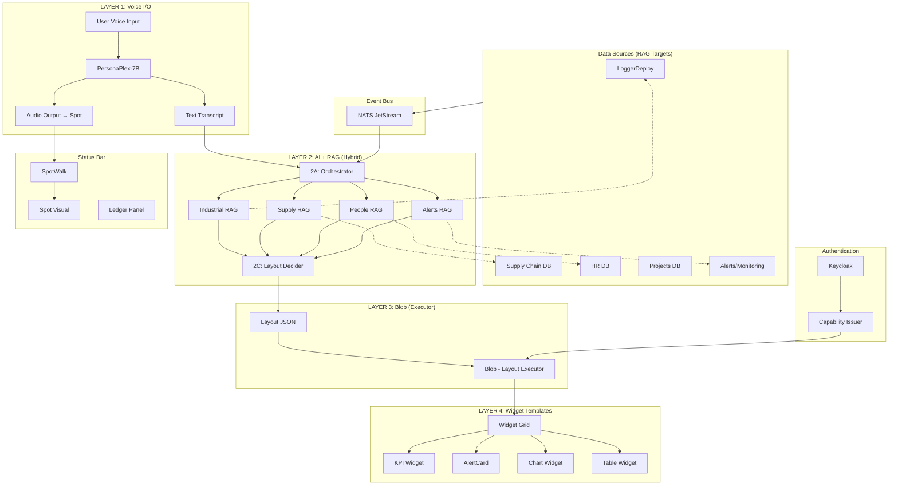

# Command Center

**The agentic landing page for NeuractOS**

---

| Suite     | Priority | Status             | Version |
| --------- | -------- | ------------------ | ------- |
| NeuractOS | P0       | Active Development | 0.1.0   |

---

## Vision

Command Center is the **one-and-all industrial operations app** for NeuractOS. It serves as the single pane of glass for everything that happens in your industrial environment:

- A single **100vh x 100vw canvas** with no global scroll
- **AI-driven widget layout** via the Blob planner
- **Role-based experiences** where different Keycloak roles see different dashboards
- **Permission-aware widgets** that only render if the user has the required capabilities

After logging in, this is the first and primary screen users see. Whether you're a floor manager, supply chain lead, HR admin, or executive — Command Center adapts to show you exactly what you need.

---

## Core Concepts

### Blob — The Layout Executor

Blob is the **dumb executor** that applies layout commands from the AI layer:

- **Receives layout JSON** from AI with widget sizes, positions, and relevance scores
- **Executes layout changes** — no decision-making, just applies what AI decides
- **Handles transitions** — animates widgets between states (slide, expand, shrink)
- **Manages grid state** — tracks current positions and sizes
- **Filters by permissions** — widgets only appear if Keycloak scopes allow

**Blob does NOT:**

- Decide which widget is more important
- Calculate relevance scores
- Choose sizes or positions
- Query databases
- Understand user intent

All intelligence lives in Layer 2 (AI). Blob just executes.

### Widgets — Self-Contained UI Components

Widgets are the building blocks of Command Center:

- **Self-scrolling**: Each widget manages its own scroll context
- **Resizable**: Blob (or user) can resize widgets to prioritize information
- **Domain-specific**: Cards, tables, charts, and interactive surfaces for each domain
- **Permission-gated**: Widgets hydrate only if the user has required capabilities

### Capability Chips

Visual indicators docked to the Ledger Panel showing:

- Current Keycloak scopes and permissions
- Trust level for actions (co-sign requirements)
- What capabilities are missing for hidden widgets

### Ledger Panel

A persistent dock for:

- Proposals awaiting approval
- Action audit trail
- Co-signature requests
- Governance visibility

---

## Voice & Visual AI Layer — 4-Layer Architecture

Command Center uses a **4-layer architecture** for voice-driven, AI-controlled widget layout:

**Voice → AI → RAG → Widget Templates → Dynamic Layout**

No agent router. Single AI layer with RAG that:

1. Understands user intent from voice
2. Retrieves relevant data from databases
3. Maps data to widget template schemas
4. Tells Blob which widgets to show/hide/resize based on relevance

### Architecture Overview

```
┌─────────────────────────────────────────────────────────────────────────┐
│  LAYER 1: VOICE I/O                                                      │
│  PersonaPlex-7B — Full-duplex conversation                               │
│  Input: User speech | Output: Voice response + Transcript                │
└─────────────────────────────────┬───────────────────────────────────────┘
                                  │ Transcript
                                  ▼
┌─────────────────────────────────────────────────────────────────────────┐
│  LAYER 2: AI UNDERSTANDING + RAG (Hybrid)                                │
│  2A: Orchestrator — lightweight intent parser, spawns RAG tasks          │
│  2B: Parallel RAG Agents — domain-specific database queries              │
│  2C: Layout Decider — maps data to widgets, calculates relevance         │
└─────────────────────────────────┬───────────────────────────────────────┘
                                  │ Widget Instructions + Data (JSON)
                                  ▼
┌─────────────────────────────────────────────────────────────────────────┐
│  LAYER 3: BLOB (Layout Executor)                                         │
│  • Receives relevance scores for each widget                             │
│  • Decides: show/hide/resize based on relevance                          │
│  • Handles transitions and animations                                    │
│  • Manages widget grid state                                             │
│  • NO DECISION-MAKING — just executes AI commands                        │
└─────────────────────────────────┬───────────────────────────────────────┘
                                  │ Layout Commands
                                  ▼
┌─────────────────────────────────────────────────────────────────────────┐
│  LAYER 4: WIDGET TEMPLATES                                               │
│  • Pre-defined scenario widgets (KPI, Alert, Chart, Table, etc.)        │
│  • Each widget knows its data schema                                     │
│  • Widgets receive mapped data from Layer 2                              │
│  • Widgets resize/animate based on Blob commands                         │
└─────────────────────────────────────────────────────────────────────────┘
```

### Spot — Visual AI Presence

Spot is a **particle visualization widget** that serves as the visual embodiment of the AI:

- **Fixed corner dock** (bottom-left of status bar)
- **State-reactive**: Visual changes reflect AI state (idle, listening, speaking, processing, success, error)
- **Size-adaptive**: Grows/shrinks within dock based on activity level
- **Always visible**: Provides constant awareness of AI availability

Spot answers the question: "Is the AI listening? Is it thinking? Did it work?"

```
┌─────────────────────────────────────────────────────────────────┐
│                        WIDGET GRID                              │
│   ┌────────┐  ┌────────┐  ┌────────┐  ┌────────┐               │
│   │ Pulse  │  │ Supply │  │ Tasks  │  │ People │               │
│   └────────┘  └────────┘  └────────┘  └────────┘               │
├─────────────────────────────────────────────────────────────────┤
│ ┌────────┐                                                      │
│ │  SPOT  │  [Capability Chips]  [Ledger: 2 pending]            │
│ │ (dock) │                                                      │
│ └────────┘                                                      │
└─────────────────────────────────────────────────────────────────┘
```

**Spot States:**

| State        | Visual                      | Trigger                       |
| ------------ | --------------------------- | ----------------------------- |
| `idle`       | Calm, small, slow particles | Default state                 |
| `listening`  | Expanded, waveform-reactive | PersonaPlex receiving audio   |
| `speaking`   | Pulsing, voice-synced       | PersonaPlex outputting speech |
| `processing` | Animated, swirling          | Agent Router analyzing        |
| `success`    | Green pulse, settles back   | Agent action completed        |
| `error`      | Red shake, returns to idle  | Agent action failed           |

### SpotWalk — Behavior Controller

SpotWalk is the **logic layer** that controls Spot's behavior:

- **State management**: Transitions Spot between states based on PersonaPlex and Agent events
- **Size control**: Adjusts Spot's size within the dock (small → medium → large)
- **Animation control**: Triggers particle behavior changes
- **Event-driven**: Responds to PersonaPlex state, agent intents, system events, and widget interactions

SpotWalk does NOT control position — Spot remains fixed in the dock.

```typescript
interface SpotWalkState {
  state: "idle" | "listening" | "speaking" | "processing" | "success" | "error";
  size: "small" | "medium" | "large";
  particleConfig: {
    speed: number; // 0.0 - 2.0
    density: number; // particle count
    color: string; // hex or gradient
    chaos: number; // 0.0 - 1.0
  };
}

// SpotWalk API
spotWalk.setState("listening");
spotWalk.setState("speaking");
spotWalk.setSize("large");
spotWalk.pulse("success"); // Temporary state with auto-return
```

---

### Layer 1: Voice I/O (PersonaPlex)

PersonaPlex-7B handles all voice interaction:

- **Listens** to user speech
- **Responds** naturally in voice
- **Outputs transcript** of conversation (both sides) to Layer 2

**Inputs:** User microphone audio (Ctrl+Space or Always-On)
**Outputs:** Voice audio (to speaker/Spot) + Text transcript (to Layer 2)

**Key Behaviors:**

- Full-duplex: can listen while speaking
- Handles interruptions, backchannels ("uh-huh")
- Persona-controlled voice and personality
- ~200ms response latency

**Voice Configuration:**

- Voice embeddings: `NATF0-3` (natural female), `NATM0-3` (natural male)
- Text prompt defines Command Center assistant persona

---

### Layer 2: Hybrid AI Architecture

Layer 2 is split into **3 sub-layers** for speed and flexibility:

```
┌─────────────────────────────────────────────────────────────────┐
│                         LAYER 2: AI LAYER                        │
│                                                                  │
│  ┌────────────────────────────────────────────────────────┐    │
│  │  2A: ORCHESTRATOR (lightweight, fast)                   │    │
│  │  • Parse intent from transcript                         │    │
│  │  • Identify which domains are relevant                  │    │
│  │  • Spawn parallel RAG tasks                             │    │
│  └─────────────────────────┬──────────────────────────────┘    │
│                            │                                    │
│         ┌──────────────────┼──────────────────────┐            │
│         ▼                  ▼                      ▼            │
│  ┌─────────────┐   ┌─────────────┐        ┌─────────────┐     │
│  │ 2B: RAG     │   │ 2B: RAG     │        │ 2B: RAG     │     │
│  │ Industrial  │   │ Supply      │   ...  │ People      │     │
│  │ (parallel)  │   │ (parallel)  │        │ (parallel)  │     │
│  └──────┬──────┘   └──────┬──────┘        └──────┬──────┘     │
│         │                 │                      │             │
│         └─────────────────┴──────────────────────┘             │
│                           │                                    │
│                           ▼                                    │
│  ┌────────────────────────────────────────────────────────┐   │
│  │  2C: LAYOUT DECIDER (single AI)                         │   │
│  │  • Receives all RAG results                             │   │
│  │  • Maps data to widget schemas                          │   │
│  │  • Calculates relevance scores                          │   │
│  │  • Decides layout (sizes, positions)                    │   │
│  │  • Outputs JSON for Blob                                │   │
│  └─────────────────────────┬──────────────────────────────┘   │
│                            │                                   │
└────────────────────────────┼───────────────────────────────────┘
                             │
                             ▼
                    LAYER 3: BLOB (execute)
```

#### 2A: Orchestrator (Lightweight Intent Parser)

**What it does:**

- Quick parse of transcript
- Identify domains involved (industrial, supply, people, tasks)
- Spawn RAG tasks only for relevant domains

**Example:**

```json
// INPUT: "What's the grid voltage and are there any alerts?"

// ORCHESTRATOR OUTPUT:
{
  "intent": ["query_metric", "query_alerts"],
  "domains": ["industrial", "alerts"],
  "spawn_rag": [
    { "domain": "industrial", "query": "grid voltage" },
    { "domain": "alerts", "query": "active alerts" }
  ],
  "skip_domains": ["supply", "people", "tasks"]
}
```

**Why lightweight:** Uses simple pattern matching or small model, doesn't need full LLM

#### 2B: Parallel RAG Agents (Domain-Specific)

Each agent knows ONE domain's database schema. Runs in parallel with other RAG agents.

| Agent              | Database     | Tables/Sources                    |
| ------------------ | ------------ | --------------------------------- |
| **Industrial RAG** | LoggerDeploy | metrics, devices, device_status   |
| **Supply RAG**     | Supply Chain | inventory, alerts, rfq, po        |
| **People RAG**     | HR           | employees, schedule, attendance   |
| **Tasks RAG**      | Projects     | tasks, milestones, assignments    |
| **Alerts RAG**     | Monitoring   | alerts, notifications, thresholds |

**Example (Industrial RAG):**

```json
// INPUT: { "domain": "industrial", "query": "grid voltage" }

// PROCESS:
// 1. Parse query → metric_name = "grid_voltage"
// 2. Generate SQL → SELECT * FROM metrics WHERE name='grid_voltage' ORDER BY timestamp DESC LIMIT 1
// 3. Execute query
// 4. Return raw data

// OUTPUT:
{
  "domain": "industrial",
  "raw_data": {
    "metric": {
      "name": "grid_voltage",
      "value": 238.4,
      "unit": "V",
      "timestamp": "..."
    },
    "related_alerts": [],
    "device": { "id": "grid-1", "status": "online" }
  }
}
```

**Why parallel:** All RAG agents run simultaneously, reduces total latency

#### 2C: Layout Decider (Single AI)

Receives ALL RAG results (merged), maps to widget schemas, calculates relevance, outputs JSON for Blob.

**Inputs:**

- Merged RAG results from all agents
- Current widget state
- User preferences (pinned widgets, etc.)
- System context (time, role, active alerts)

**Relevance Factors:**

| Factor                 | Description                        | Weight |
| ---------------------- | ---------------------------------- | ------ |
| **Direct request**     | User explicitly asked for this     | High   |
| **Domain match**       | Widget domain matches query domain | Medium |
| **Data availability**  | RAG returned data for this widget  | High   |
| **System alerts**      | System is pushing alerts for this  | High   |
| **Temporal relevance** | Recent activity in this area       | Medium |
| **User role**          | Widget relevant to user's job      | Low    |
| **Historical usage**   | User frequently uses this widget   | Low    |

**Output Format (for Blob):**

```json
{
  "widgets": [
    {
      "id": "kpi-voltage",
      "relevance": 0.95,
      "size": "hero",
      "position": "top-center",
      "data": { "label": "Grid Voltage", "value": "238.4", "unit": "V" }
    },
    {
      "id": "alert-card",
      "relevance": 0.7,
      "size": "expanded",
      "position": "middle-left",
      "data": { "severity": "warning", "message": "Pump 3 temp" }
    },
    {
      "id": "supply-table",
      "relevance": 0.2,
      "size": "compact",
      "position": "bottom",
      "data": null
    },
    {
      "id": "people-card",
      "relevance": 0.0,
      "size": "hidden",
      "position": null,
      "data": null
    }
  ],
  "transitions": {
    "kpi-voltage": "slide-in-from-top",
    "supply-table": "shrink"
  }
}
```

**Timing (Parallel Advantage):**

```
SEQUENTIAL (old plan):
  Intent: 100ms → RAG1: 200ms → RAG2: 200ms → RAG3: 200ms → Layout: 100ms
  TOTAL: 800ms

PARALLEL (new plan):
  Orchestrator: 50ms
       ↓
  RAG1: 200ms ─┐
  RAG2: 200ms ─┼─ (parallel, max 200ms)
  RAG3: 200ms ─┘
       ↓
  Layout Decider: 100ms
  TOTAL: 350ms (56% faster)
```

---

### Layer 3: Blob (Layout Executor)

Blob receives layout JSON from Layer 2 and executes it. **No decision-making.**

**Size Mapping:**

| Size       | CSS Dimensions                |
| ---------- | ----------------------------- |
| `hero`     | width: 100%, height: 60vh     |
| `expanded` | width: 48%, height: 40vh      |
| `normal`   | width: 32%, height: 30vh      |
| `compact`  | width: 24%, height: 15vh      |
| `hidden`   | display: none (or off-canvas) |

**Position Mapping:**

| Position       | Grid Placement           |
| -------------- | ------------------------ |
| `top-center`   | grid-area: 1 / 2         |
| `middle-left`  | grid-area: 2 / 1         |
| `middle-right` | grid-area: 2 / 3         |
| `bottom`       | grid-area: 3 / 1 / 3 / 4 |

**Transitions:**

| Transition           | Animation                   |
| -------------------- | --------------------------- |
| `slide-in-from-top`  | animate Y from -100% to 0   |
| `slide-in-from-left` | animate X from -100% to 0   |
| `expand`             | animate scale from 0.5 to 1 |
| `shrink`             | animate scale from 1 to 0.8 |
| `fade-out`           | animate opacity to 0        |

**Transition Rules:**

```
WHEN relevance increases:
  • Widget slides in from edge
  • Widget expands smoothly
  • Other widgets shift to make room

WHEN relevance decreases:
  • Widget shrinks
  • Widget slides toward edge
  • Eventually slides off-canvas

WHEN user explicitly requests:
  • Override relevance calculation
  • Pin widget at requested size
  • Mark as "user-controlled" (don't auto-resize)

WHEN system alert:
  • Alert widget jumps to HERO temporarily
  • Previous HERO shifts down
  • After acknowledgment, returns to calculated relevance
```

**Grid Layout:**

```
┌─────────────────────────────────────────────────────────────┐
│                    HERO ZONE (top)                           │
│  ┌─────────────────────────────────────────────────────┐    │
│  │           KPI: Grid Voltage (relevance: 1.0)        │    │
│  │                     238.4 V                          │    │
│  └─────────────────────────────────────────────────────┘    │
├─────────────────────────────────────────────────────────────┤
│                   EXPANDED ZONE (middle)                     │
│  ┌──────────────────────┐  ┌──────────────────────┐        │
│  │  Chart: Voltage Trend│  │  AlertCard: Active   │        │
│  │  (relevance: 0.6)    │  │  (relevance: 0.5)    │        │
│  └──────────────────────┘  └──────────────────────┘        │
├─────────────────────────────────────────────────────────────┤
│                   COMPACT ZONE (bottom)                      │
│  ┌────────┐ ┌────────┐ ┌────────┐ ┌────────┐              │
│  │ Table  │ │ Tasks  │ │ Supply │ │ People │              │
│  │ (0.2)  │ │ (0.1)  │ │ (0.1)  │ │ (0.0)  │ ← may hide   │
│  └────────┘ └────────┘ └────────┘ └────────┘              │
└─────────────────────────────────────────────────────────────┘
```

---

### Layer 4: Widget Templates

Widgets are pre-built from the **scenario system** in designWorkbench:

```
scenario_extracts_industrial.json
└── extracts[]
    ├── component_name: "KPI"
    ├── component_source: "<React JSX>"
    └── scenarios[] (data variations for testing)
```

**Widget Registry:**

| Widget     | Data Schema                                | Sizes                   | Voice Triggers                       |
| ---------- | ------------------------------------------ | ----------------------- | ------------------------------------ |
| KPI        | `{ label, value, unit, trend, threshold }` | hero, expanded, compact | "show X", "what's the X"             |
| AlertCard  | `{ severity, message, timestamp, source }` | hero, expanded, compact | "alerts", "warnings", "issues"       |
| Chart      | `{ series[], labels[], type }`             | hero, expanded          | "trend", "graph", "chart"            |
| Table      | `{ columns[], rows[], sortBy }`            | expanded, compact       | "list", "table", "all X"             |
| StatusCard | `{ status, label, icon, detail }`          | expanded, compact       | "status of", "is X running"          |
| Timeline   | `{ events[] }`                             | hero, expanded          | "events", "history", "what happened" |

**Size Behaviors:**

| Size         | Behavior                                                                           |
| ------------ | ---------------------------------------------------------------------------------- |
| **HERO**     | Full detail display, all data fields, interactive controls, full resolution charts |
| **EXPANDED** | Key data fields, some interactivity, simplified chart view                         |
| **COMPACT**  | Single headline value, minimal chrome, click to expand, no interactivity           |
| **HIDDEN**   | Not rendered, available in widget menu, can be pinned by user                      |

---

### Relevance Decay

Widgets don't stay at high relevance forever:

```
DECAY RULES:

• User requested → high relevance for 5 minutes, then decay
• System alert → high relevance until acknowledged
• Conversation context → relevance follows conversation topic
• Idle timeout → all widgets return to role-based defaults

DECAY CURVE:
  1.0 ──────┐
            │
            └────────────────┐
  0.5                        └──────────┐
                                        └────── 0.2 (baseline)
  ├────────────────────────────────────────────►
  0        2min       5min      10min     time
```

---

### User Override

User can always override automatic layout:

| Action             | Effect                                               |
| ------------------ | ---------------------------------------------------- |
| **"Pin this"**     | Widget stays at current size, ignores relevance      |
| **"Hide this"**    | Widget goes off-canvas, stays hidden                 |
| **"Show me X"**    | Widget jumps to HERO, overrides calculated relevance |
| **Manual resize**  | Widget becomes "user-controlled", no auto-resize     |
| **"Reset layout"** | Clear all pins, return to automatic relevance        |

---

### System Triggers (Non-Voice)

Not everything comes from voice. System can also trigger relevance changes:

| Trigger              | Source       | Effect                                             |
| -------------------- | ------------ | -------------------------------------------------- |
| **Alert fired**      | LoggerDeploy | AlertCard relevance → 1.0                          |
| **Threshold breach** | Monitoring   | Related KPI relevance → 0.9                        |
| **Scheduled event**  | Calendar     | Task widget relevance increases                    |
| **User role change** | Keycloak     | Rebalance all widget relevance                     |
| **Time of day**      | System clock | Shift focus (morning = tasks, afternoon = reports) |
| **External webhook** | API          | Custom relevance boost                             |

---

### Voice Model Stack

| Component       | Model                           | VRAM  | Purpose                          |
| --------------- | ------------------------------- | ----- | -------------------------------- |
| **PersonaPlex** | NVIDIA PersonaPlex-7B-v1 (Moshi)| ~14GB | Full-duplex speech-to-speech     |
| **AI + RAG**    | Phi-3 or similar                | ~8GB  | Understanding + RAG              |
| **Total**       | -                               | ~22GB | Fits RTX PRO 6000 (98GB)        |

All models run locally on RTX PRO 6000 Blackwell Max-Q Workstation Edition (98GB VRAM).

PersonaPlex-7B is a native speech-to-speech model — it replaces the old STT → LLM → TTS
pipeline with a single model that handles voice I/O end-to-end at ~170ms latency.

---

### Example Data Flow

```
USER: "What's happening with the pumps?"

LAYER 1 (PersonaPlex):
  → Transcribes: "What's happening with the pumps?"
  → Responds: "Let me check the pump status for you..."

LAYER 2 (AI + RAG):
  → 2A Orchestrator: intent = status_query, domain = industrial, entity = pumps
  → 2B RAG queries (parallel):
    • Industrial: SELECT * FROM device_status WHERE device_type='pump'
    • Alerts: SELECT * FROM alerts WHERE source LIKE '%pump%' AND acknowledged=false
  → Retrieved data:
    • 4 pumps, 3 running, 1 warning
    • 1 active alert: "Pump 3 temperature elevated"
  → 2C Layout Decider maps to widgets:
    • StatusCard: { status: 'warning', label: 'Pump Status', detail: '3/4 running' }
    • AlertCard: { severity: 'warning', message: 'Pump 3 temp elevated' }
    • Table: { columns: [...], rows: [pump1, pump2, pump3, pump4] }
  → Relevance scores:
    • StatusCard (pumps): 0.9
    • AlertCard: 0.8
    • Table (devices): 0.6
    • KPI (any metric): 0.2
    • Chart: 0.3
    • People/Supply: 0.0

LAYER 3 (Blob):
  → Receives layout JSON
  → Executes layout:
    • StatusCard → HERO
    • AlertCard → EXPANDED
    • Table → EXPANDED
    • Chart → COMPACT
    • Others → HIDDEN
  → Animate transitions

LAYER 4 (Widgets):
  → StatusCard receives { status: 'warning', label: 'Pump Status', ... }
  → AlertCard receives { severity: 'warning', message: '...' }
  → Table receives device list
  → All render at assigned sizes

LAYER 1 (PersonaPlex):
  → Speaks: "Three out of four pumps are running. Pump 3 has an elevated temperature warning."
```

---

### Fallback Mode

If PersonaPlex is unavailable, SpotVox falls back to the legacy two-stage pipeline:

```
User Voice → ASR (Parakeet) → Intent LLM (Phi-3) → Intent JSON → Blob
```

This provides command-only voice control without natural conversation.

---

## Domain Coverage

Command Center unifies all industrial operations into a single interface:

| Domain                    | Description                                             | Data Source          |
| ------------------------- | ------------------------------------------------------- | -------------------- |
| **Industrial Monitoring** | Real-time device data, metrics, pulse, alarms           | LoggerDeploy         |
| **Supply Chain**          | Inventory, procurement, RFQ/PO flows, vendor management | Supply Chain Service |
| **People Management**     | Workforce scheduling, attendance, HR actions            | People Service       |
| **Project Management**    | Tasks, milestones, timelines, Gantt views               | Project Service      |
| **Messaging**             | Internal communications, chat, notifications            | Messaging Service    |
| **Reporting**             | NeuraReport surfaces, analytics, dashboards             | Reporter Service     |
| **Browser/Chatbot**       | Internal web surfaces, AI chat interfaces               | Blob + Services      |

Each domain surfaces as widgets that appear based on user role and current workflow context.

---

## Role-Based Experiences

The same Command Center app, different experiences:

| Role                  | Sees                                         | Example Widgets                            |
| --------------------- | -------------------------------------------- | ------------------------------------------ |
| **Floor Manager**     | Production metrics, device status, alarms    | Pulse cards, Device map, Alert ticker      |
| **Supply Chain Lead** | Inventory levels, pending POs, vendor status | Supply cards, RFQ table, Stock charts      |
| **HR Admin**          | Attendance, scheduling, leave requests       | People cards, Schedule grid, Requests list |
| **Maintenance Tech**  | Device health, job queue, work orders        | Device status, Job list, Alert panel       |
| **Executive**         | High-level KPIs, cross-domain summary        | KPI cards, Trend charts, Summary widgets   |
| **Full Admin**        | Everything                                   | All widgets available                      |

Keycloak roles and capabilities determine which widgets hydrate. Blob arranges them intelligently.

---

## Architecture

### Tech Stack

| Layer         | Technology                  | Purpose                                     |
| ------------- | --------------------------- | ------------------------------------------- |
| **Frontend**  | Next.js 14, React 18        | App shell, widget rendering, SSR            |
| **Backend**   | Django 5.x                  | API gateway, widget registry, RAG endpoints |
| **Messaging** | NATS JetStream              | Real-time events, pub/sub                   |
| **Auth**      | Keycloak                    | OIDC authentication, capability issuer      |
| **Audit**     | Ledger Gateway              | Proposals, approvals, audit trail           |
| **Data**      | World Graph                 | Unified graph database for scene data       |
| **Visual AI** | Spot (Three.js, React)      | Particle visualization for AI presence      |
| **Voice**     | SpotVox (PersonaPlex + RAG) | 4-layer: Voice → AI+RAG → Blob → Widgets    |
| **GPU**       | RTX 6000 Blackwell          | Local inference (~22GB: PersonaPlex + AI)   |

### Integration Points (4-Layer Architecture)

```
┌─────────────────────────────────────────────────────────────────────┐
│                        COMMAND CENTER                                │
│                                                                      │
│  ┌────────────────────────────────────────────────────────────────┐ │
│  │                     LAYER 4: WIDGET TEMPLATES                   │ │
│  │  ┌──────────┐  ┌──────────┐  ┌──────────┐  ┌──────────┐       │ │
│  │  │   KPI    │  │  Alert   │  │  Chart   │  │  Table   │ ...   │ │
│  │  │  Widget  │  │  Widget  │  │  Widget  │  │  Widget  │       │ │
│  │  └────┬─────┘  └────┬─────┘  └────┬─────┘  └────┬─────┘       │ │
│  └───────┼─────────────┼─────────────┼─────────────┼─────────────┘ │
│          │             │             │             │                │
│          └─────────────┴──────┬──────┴─────────────┘                │
│                               │                                      │
│  ┌────────────────────────────▼─────────────────────────────────┐   │
│  │              LAYER 3: BLOB (Layout Executor)                  │   │
│  │  • Receives layout JSON with relevance scores                 │   │
│  │  • Executes size/position changes (NO decision-making)        │   │
│  │  • Handles transitions and animations                         │   │
│  └────────────────────────────▲─────────────────────────────────┘   │
│                               │ Layout JSON                          │
│                               │                                      │
│  ┌────────────────────────────┴─────────────────────────────────┐   │
│  │              LAYER 2: AI + RAG (Hybrid)                       │   │
│  │  ┌─────────────────────────────────────────────────────────┐ │   │
│  │  │ 2A: Orchestrator (intent parsing)                        │ │   │
│  │  └─────────────────────┬───────────────────────────────────┘ │   │
│  │          ┌─────────────┼─────────────┐                       │   │
│  │          ▼             ▼             ▼                       │   │
│  │  ┌─────────────┐ ┌─────────────┐ ┌─────────────┐            │   │
│  │  │ Industrial  │ │   Supply    │ │   People    │            │   │
│  │  │     RAG     │ │     RAG     │ │     RAG     │ (parallel) │   │
│  │  └──────┬──────┘ └──────┬──────┘ └──────┬──────┘            │   │
│  │         └───────────────┼───────────────┘                    │   │
│  │                         ▼                                    │   │
│  │  ┌─────────────────────────────────────────────────────────┐ │   │
│  │  │ 2C: Layout Decider (maps data → widgets, relevance)     │ │   │
│  │  └─────────────────────────────────────────────────────────┘ │   │
│  └────────────────────────────▲─────────────────────────────────┘   │
│                               │ Transcript                           │
│                               │                                      │
│  ┌────────────────────────────┴─────────────────────────────────┐   │
│  │              LAYER 1: VOICE I/O (PersonaPlex-7B)              │   │
│  │  Full-duplex | ~200ms latency | Audio + Transcript output     │   │
│  └────────────────────────────▲─────────────────────────────────┘   │
│                               │                                      │
│                        User Voice Input                              │
│                      (Ctrl+Space / Always-On)                        │
│                                                                      │
│  ┌──────────────────────────────────────────────────────────────┐   │
│  │                          STATUS BAR                           │   │
│  │  ┌────────┐  ┌─────────────────┐  ┌────────┐                 │   │
│  │  │  SPOT  │  │ Capability Chips│  │ Ledger │                 │   │
│  │  │(visual)│  │                 │  │ Panel  │                 │   │
│  │  └────────┘  └─────────────────┘  └────────┘                 │   │
│  └──────────────────────────────────────────────────────────────┘   │
└─────────────────────────────────────────────────────────────────────┘
                                           │
          ┌────────────────────────────────┼────────────────┐
          │                                │                │
          ▼                                ▼                ▼
   ┌────────────┐                   ┌────────────┐   ┌────────────┐
   │LoggerDeploy│                   │  Keycloak  │   │   NATS     │
   │   (Data)   │                   │  (Auth)    │   │  (Events)  │
   └────────────┘                   └────────────┘   └────────────┘
          │                                │                │
          ▼                                ▼                ▼
   ┌────────────┐                   ┌────────────┐   ┌────────────┐
   │ PostgreSQL │                   │   Realm    │   │ JetStream  │
   │ (Storage)  │                   │  (Scopes)  │   │  (Queue)   │
   └────────────┘                   └────────────┘   └────────────┘
```

---

## Data Flow (4-Layer Architecture)



---

## Widget System

### Widget Lifecycle

1. **Discovery**: Blob queries widget registry for available widgets
2. **Filtering**: Widgets filtered by user's Keycloak capabilities
3. **Placement**: Blob calculates optimal layout based on context
4. **Hydration**: Widgets fetch their data from respective services
5. **Rendering**: Widgets render within their allocated canvas space
6. **Updates**: Real-time updates via NATS subscriptions

### Widget Contract

Each widget must implement:

```typescript
interface Widget {
  id: string;
  domain:
    | "industrial"
    | "supply"
    | "people"
    | "projects"
    | "messaging"
    | "reporting";
  requiredCapabilities: string[]; // Keycloak scopes required
  minSize: { width: number; height: number };
  maxSize: { width: number; height: number };
  priority: number; // Blob uses this for layout decisions

  // Lifecycle hooks
  onMount(): void;
  onResize(width: number, height: number): void;
  onDataUpdate(data: unknown): void;
  onUnmount(): void;
}
```

---

## Canvas Architecture

### No Global Scroll

Command Center locks to `100vh x 100vw`:

```
┌─────────────────────────────────────────────────────────────────┐
│                         100vw viewport                           │
│  ┌───────────────────────────────────────────────────────────┐  │
│  │                                                            │  │
│  │                     WIDGET GRID                            │  │
│  │        (each widget has internal scroll)                   │  │ 100vh
│  │                                                            │  │
│  │   ┌────────┐  ┌────────┐  ┌────────┐  ┌────────┐          │  │
│  │   │ Widget │  │ Widget │  │ Widget │  │ Widget │          │  │
│  │   └────────┘  └────────┘  └────────┘  └────────┘          │  │
│  │                                                            │  │
│  ├───────────────────────────────────────────────────────────┤  │
│  │ ┌────────┐                                                 │  │
│  │ │  SPOT  │  [Capability Chips]        [Ledger Panel]      │  │
│  │ │(visual)│                                                 │  │
│  │ └────────┘                                                 │  │
│  └───────────────────────────────────────────────────────────┘  │
└─────────────────────────────────────────────────────────────────┘
        ▲
        │
   SpotVox: Ctrl+Space to speak
```

### Responsive Layout

Blob adapts the grid for different screen sizes:

| Screen                 | Layout Strategy                                |
| ---------------------- | ---------------------------------------------- |
| **Desktop (1920+)**    | Full grid, multiple columns, all docks visible |
| **Laptop (1280-1919)** | Condensed grid, collapsible panels             |
| **Tablet (768-1279)**  | Stacked widgets, swipe navigation              |
| **Mobile (< 768)**     | Single widget focus, bottom navigation         |

---

## Supporting Services

### LoggerDeploy

The industrial data acquisition backbone:

- **Device Discovery**: Scans networks for Modbus/OPC-UA devices
- **Schema Creation**: Defines data structures from device registers
- **Table Mapping**: Links devices to database tables
- **Job Execution**: Runs continuous/triggered logging jobs
- **Metrics Streaming**: Real-time data for Command Center widgets

LoggerDeploy provides the "Pulse" that powers industrial monitoring widgets.

### World Graph

Unified graph database for:

- Scene data and spatial relationships
- Entity connections (devices, people, locations)
- Historical context and lineage

### Keycloak & Capability Issuer

Authentication and authorization:

- OIDC-based login
- Role-based access control
- Fine-grained capabilities for widget hydration
- Co-signature requirements for sensitive actions

### NATS JetStream

Event bus for real-time updates:

- Pub/sub for widget data streams
- Durable subscriptions for reliability
- Cross-service event propagation

### Ledger Gateway

Governance layer:

- Proposal submission and routing
- Multi-signature approvals
- Audit trail for all actions
- Chain anchors for immutability

---

## PersonaPlex Setup

### Prerequisites

- **GPU**: NVIDIA GPU with CUDA support (tested on RTX PRO 6000 Blackwell, 98GB VRAM)
- **CUDA**: cu129 nightly for Blackwell architecture (sm_120), cu124+ for Ampere/Ada
- **Python**: 3.11+
- **System packages**: `libopus-dev` (Arch: `opus`)
- **HuggingFace token**: Required to download PersonaPlex-7B weights (set `HF_TOKEN`)

### Installation

```bash
# 1. Clone PersonaPlex into the project
cd /path/to/CommandCenter
git clone https://github.com/NVIDIA/personaplex.git

# 2. Create virtual environment
cd personaplex
python -m venv venv
source venv/bin/activate

# 3. Install PyTorch with correct CUDA version
# For Blackwell (sm_120) - REQUIRES NIGHTLY BUILD:
pip install --pre torch torchvision torchaudio --index-url https://download.pytorch.org/whl/nightly/cu129

# For Ampere/Ada (stable release):
# pip install torch torchvision torchaudio --index-url https://download.pytorch.org/whl/cu124

# 4. Install the Moshi server package
pip install moshi

# 5. Relax Moshi version constraint for PyTorch nightly (Blackwell only)
# Edit: venv/lib/python3.11/site-packages/moshi-*.dist-info/METADATA
# Change: Requires-Dist: torch<2.10,>=2.2.0
# To:     Requires-Dist: torch>=2.2.0

# 6. Verify GPU detection
python -c "import torch; print(f'CUDA: {torch.cuda.is_available()}, GPU: {torch.cuda.get_device_name(0) if torch.cuda.is_available() else \"N/A\"}')"

# 7. Install frontend dependencies
cd ../frontend
npm install
```

### Blackwell GPU Support Note

NVIDIA Blackwell GPUs (sm_120) require PyTorch nightly builds with CUDA 12.9. Stable PyTorch releases (2.9.0 and earlier) only support up to sm_90 (Ampere/Ada). This is a temporary limitation until PyTorch releases stable versions with Blackwell support.

### Running

#### Option 1: Daemon Mode (Recommended)

PersonaPlex takes 30-60 seconds to load models. Run it as a persistent daemon to avoid waiting every time:

```bash
# Start PersonaPlex daemon (runs in background)
./scripts/personaplex-daemon.sh start

# Check status
./scripts/personaplex-daemon.sh status

# View logs
./scripts/personaplex-daemon.sh logs

# Stop daemon
./scripts/personaplex-daemon.sh stop

# Restart
./scripts/personaplex-daemon.sh restart
```

Once the daemon is running, `./scripts/dev.sh` will detect it and skip the startup wait.

#### Option 2: Integrated Mode

The dev server can also launch PersonaPlex automatically (but you'll wait for model loading each time):

```bash
./scripts/dev.sh
```

PersonaPlex serves on port **8998** with SSL (self-signed certs auto-generated).
The frontend connects via `wss://localhost:8998/api/chat` using the Moshi binary WebSocket protocol.

### Voice Personas

PersonaPlex supports configurable voice personas via PyTorch embedding files:

| Voice Code | Description         |
| ---------- | ------------------- |
| `NATF0-3`  | Natural female 0–3  |
| `NATM0-3`  | Natural male 0–3    |
| `VARF0-4`  | Variety female 0–4  |
| `VARM0-4`  | Variety male 0–4    |

Set `NEXT_PUBLIC_PERSONAPLEX_VOICE=NATF2` (or any code above) in your environment.

### Architecture

```
Mic → opus-recorder (24kHz Opus) → WebSocket → PersonaPlex-7B → WebSocket → Opus decoder → AudioWorklet → Speaker
                                                     ↓
                                              Text tokens (incremental)
                                                     ↓
                                              Transcript display
```

PersonaPlex-7B is a full-duplex speech-to-speech model based on the Moshi architecture.
It processes audio bidirectionally — listening and speaking simultaneously — with ~170ms latency.
No separate STT, LLM, or TTS components are needed.

---

## Quick Reference

### Key Terminology

| Term                     | Definition                                                                   |
| ------------------------ | ---------------------------------------------------------------------------- |
| **4-Layer Architecture** | Voice → AI+RAG → Blob → Widgets — the core Command Center pipeline           |
| **Blob**                 | Layout Executor (Layer 3) — receives JSON, executes layout, NO decisions     |
| **Spot**                 | Visual AI presence — particle widget that shows AI state in the status bar   |
| **SpotWalk**             | Behavior controller for Spot — manages state, size, and animation            |
| **SpotVox**              | Voice interface — Layer 1 (PersonaPlex) + Layer 2 (AI+RAG)                   |
| **PersonaPlex**          | Layer 1: NVIDIA's full-duplex speech-to-speech model (~200ms latency)        |
| **Orchestrator**         | Layer 2A: Lightweight intent parser, spawns parallel RAG tasks               |
| **RAG Agent**            | Layer 2B: Domain-specific database query agent (runs in parallel)            |
| **Layout Decider**       | Layer 2C: Maps RAG data to widgets, calculates relevance, outputs JSON       |
| **Relevance**            | Score (0.0-1.0) determining widget size/position (AI decides, Blob executes) |
| **Widget Template**      | Layer 4: Pre-built UI component with known data schema (from scenarios)      |
| **Widget**               | Self-contained UI component for a specific domain/function                   |
| **Lens**                 | A filtered view or perspective within Command Center                         |
| **Scene**                | A spatial/contextual snapshot from World Graph                               |
| **Capability**           | A Keycloak scope that grants permission for an action                        |
| **Ledger**               | The audit and approval tracking system                                       |
| **Pulse**                | Real-time metrics and events from industrial systems                         |
| **Layout JSON**          | Structured output from Layer 2C → Layer 3 with widget sizes/positions        |
| **Transcript**           | Text stream from PersonaPlex (Layer 1) → Layer 2                             |

### Environment Variables

```bash
# Core
NEXT_PUBLIC_API_URL=http://localhost:8000
NEXT_PUBLIC_KEYCLOAK_URL=http://localhost:8080
NEXT_PUBLIC_KEYCLOAK_REALM=neuract
NEXT_PUBLIC_KEYCLOAK_CLIENT=command-center

# Services
LOGGER_DEPLOY_URL=http://localhost:8001
NATS_URL=nats://localhost:4222
WORLD_GRAPH_URL=http://localhost:9000

# Voice & Visual AI (4-Layer Architecture)
SPOT_ENABLED=true
SPOTVOX_ENABLED=true
SPOTVOX_MODE=4layer                  # 4layer | legacy (fallback to ASR→Intent)
SPOTVOX_HOTKEY=ctrl+space
SPOTVOX_ALWAYS_ON=false              # Enable always-listening mode
SPOTVOX_GPU_DEVICE=cuda:0            # GPU for local inference

# Layer 1: PersonaPlex Configuration
PERSONAPLEX_SERVER_URL=https://localhost:8998
PERSONAPLEX_MODEL=personaplex-7b-v1
PERSONAPLEX_VOICE=NATF2              # NATF0-3, NATM0-3, VARF0-4, VARM0-4
PERSONAPLEX_VRAM=14                  # GB reserved for PersonaPlex

# Layer 2: AI + RAG Configuration
AI_ORCHESTRATOR_MODEL=phi3           # Lightweight intent parser (2A)
AI_LAYOUT_DECIDER_MODEL=phi3         # Widget/relevance mapper (2C)
AI_RAG_VRAM=8                        # GB reserved for AI layer

# Layer 2B: RAG Agents (parallel)
RAG_INDUSTRIAL_ENABLED=true          # Industrial RAG → LoggerDeploy
RAG_SUPPLY_ENABLED=true              # Supply RAG → Supply Chain DB
RAG_PEOPLE_ENABLED=true              # People RAG → HR DB
RAG_TASKS_ENABLED=true               # Tasks RAG → Projects DB
RAG_ALERTS_ENABLED=true              # Alerts RAG → Monitoring DB

# Layer 3: Blob (Layout Executor)
BLOB_EXECUTOR_ENABLED=true
BLOB_TRANSITION_DURATION=300         # ms for widget transitions

# Legacy Fallback (when SPOTVOX_MODE=legacy)
SPOTVOX_ASR_MODEL=parakeet           # parakeet | whisper
SPOTVOX_INTENT_MODEL=phi3            # phi3 | llama3

# Feature Flags
ENABLE_BLOB=true
ENABLE_LEDGER=true
ENABLE_RAG=true                      # Enable parallel RAG agents
```

---

## Related Documentation

- [LoggerDeploy](../LoggerDeploy/README.md) — Industrial data acquisition service
- [Spot](../spot/Spot/README.md) — Particle visualization engine
- [SpotVox](../spot/SpotVox/Spot-Vox/README.md) — Voice dictation and task extraction
- [NeuractOS Desktop](./docs/desktop.md) — Desktop shell and window manager
- [Keycloak Configuration](./docs/keycloak.md) — Auth setup guide
- [Widget Development](./docs/widgets.md) — How to create new widgets
- [Voice Commands](./docs/voice-commands.md) — SpotVox command reference

---

## License

Proprietary — Neuract Technologies

---
